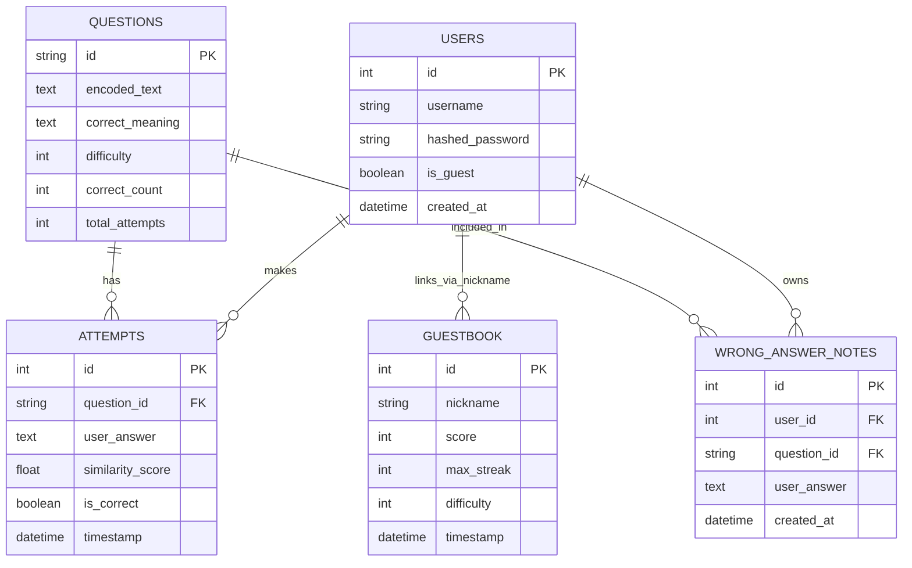

# 2. Low-Level Design (LLD)

## 2.1 데이터베이스 스키마 (Database Schema)

```mermaid
erDiagram
    USERS ||--o{ ATTEMPTS : makes
    USERS ||--o{ WRONG_ANSWER_NOTES : owns
    %% GUESTBOOK is logically related but stores nickname directly for simplicity
    USERS ||--o{ GUESTBOOK : links_via_nickname
    QUESTIONS ||--o{ ATTEMPTS : has
    QUESTIONS ||--o{ WRONG_ANSWER_NOTES : included_in

    USERS {
        int id PK
        string username
        string hashed_password
        boolean is_guest
        datetime created_at
    }

    QUESTIONS {
        string id PK
        text encoded_text
        text correct_meaning
        int difficulty
        int correct_count
        int total_attempts
    }

    WRONG_ANSWER_NOTES {
        int id PK
        int user_id FK
        string question_id FK
        text user_answer
        datetime created_at
    }

    GUESTBOOK {
        int id PK
        string nickname
        int score
        int max_streak
        int difficulty
        datetime timestamp
    }

    ATTEMPTS {
        int id PK
        string question_id FK
        text user_answer
        float similarity_score
        boolean is_correct
        datetime timestamp
    }
```

## 2.2 API 명세 (API Specification)

### 인증 (Auth)
*   `POST /api/auth/register`: 회원가입
