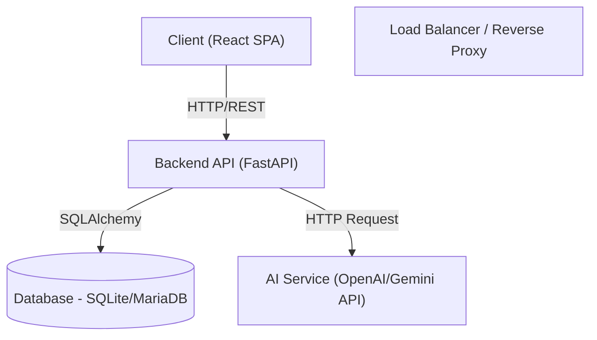
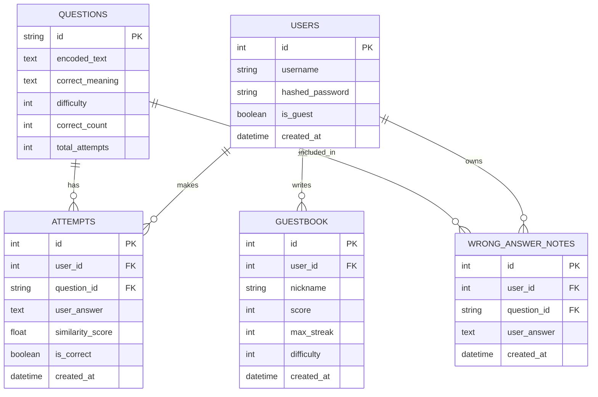
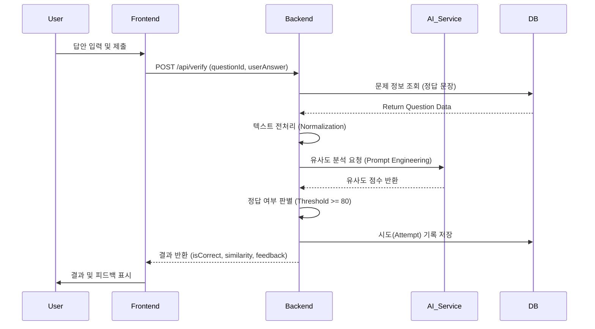
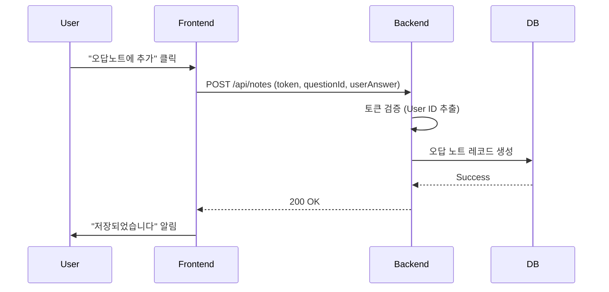

# Context Hunter - 시스템 설계 문서 (HLD & LLD)

이 문서는 Context Hunter 프로젝트의 고수준 설계(HLD)와 저수준 설계(LLD)를 통합하여 기술합니다.

---

# 1. High-Level Design (HLD)

## 1.1 시스템 아키텍처 (System Architecture)

Context Hunter는 클라이언트-서버 구조를 따르는 웹 애플리케이션입니다.


## 1.2 기술 스택 (Technology Stack)

| 구분 | 기술 | 설명 |
|---|---|---|
| **Frontend** | React, TypeScript | 사용자 인터페이스 구현 |
| | Vite | 빌드 도구 및 개발 서버 |
| | Tailwind CSS | 스타일링 프레임워크 |
| **Backend** | Python, FastAPI | 고성능 비동기 웹 프레임워크 |
| | SQLAlchemy | ORM (Object Relational Mapping) |
| | Pydantic | 데이터 검증 및 설정 관리 |
| | JWT (Jose) | 사용자 인증 및 토큰 관리 |
| **Database** | SQLite (Dev) / MariaDB (Prod) | 관계형 데이터베이스 |
| **AI** | OpenAI / Gemini API | 문맥 유사도 분석 및 문제 생성 |

## 1.3 주요 기능 및 모듈 (Key Features & Modules)

1.  **사용자 관리 (User Management)**
    *   회원가입, 로그인 (JWT 기반)
    *   게스트 로그인 지원
2.  **게임 플레이 (Game Play)**
    *   **일일 모드 (Daily Mode)**: 매일 10문제 풀이
    *   **도전 모드 (Challenge Mode)**: 무한 모드, 3번 틀리면 종료
    *   난이도 조절 (청년층, 중장년층, 노년층)
3.  **AI 분석 (AI Analysis)**
    *   사용자 입력 답안과 정답의 문맥 유사도 분석 (0~100%)
    *   정답 여부 판별
4.  **오답 노트 (Wrong Answer Note)**
    *   틀린 문제 저장 및 복습 기능
5.  **랭킹 시스템 (Ranking System)**
    *   도전 모드 점수 기록 및 글로벌 순위 표시 (로그인 사용자 전용)
    *   **랭킹 뱃지 (Ranking Badges)**: 순위에 따라 프로필 아이콘에 뱃지 표시 (1위~100위)
    *   **명예의 전당 (Hall of Fame)**: 메인 화면에 상위 3명 랭킹 표시
6.  **소셜 공유 (Social Sharing)**
    *   일일 모드 결과를 이모지 또는 텍스트 형태로 클립보드에 복사하여 공유
    *   Clipboard API 미지원 환경을 위한 Fallback 메커니즘 적용
7.  **피드백 시스템 (Feedback System)**
    *   **청각적**: Web Audio API를 이용한 효과음 (정답/오답/클릭)
    *   **시각적**: 오답 시 화면 흔들림 효과 (Shake Animation)
8.  **UI/UX 개선**
    *   **푸터 (Footer)**: 저작권 및 관련 링크 제공
    *   **프로필 뱃지**: 랭킹에 따른 시각적 보상 제공

---

# 2. Low-Level Design (LLD)

## 2.1 데이터베이스 스키마 (Database Schema)



## 2.2 API 명세 (API Specification)

### 인증 (Auth)
*   `POST /api/auth/register`: 회원가입
*   `POST /api/auth/login`: 로그인 (Access Token 발급)
*   `POST /api/auth/guest`: 게스트 로그인
*   `GET /api/users/me`: 현재 사용자 정보 조회

### 문제 (Questions)
*   `GET /api/questions`: 난이도별 문제 목록 조회
*   `POST /api/verify`: 정답 확인 및 유사도 검사

### 오답 노트 (Notes)
*   `POST /api/notes`: 오답 노트 생성
*   `GET /api/notes`: 내 오답 노트 조회
*   `DELETE /api/notes/{note_id}`: 오답 노트 삭제

### 랭킹/방명록 (Rankings)
*   `GET /api/rankings`: 글로벌 랭킹 조회 (통합 랭킹)
*   `POST /api/guestbook`: 랭킹(방명록) 저장 (로그인 유저 자동 저장)

## 2.3 프론트엔드 컴포넌트 구조 (Frontend Component Tree)

```text
App
├── AuthProvider (Context)
├── SoundProvider (Context)
├── AppContent
│   ├── LoginScreen
│   ├── SignupScreen
│   ├── MainScreen
│   │   ├── ModeSelection
│   │   └── WrongAnswerNoteButton
│   ├── DifficultyScreen
│   ├── GameScreen
│   │   ├── QuestionDisplay
│   │   ├── AnswerInput
│   │   └── FeedbackDisplay (Sound/Shake)
│   ├── DailyResultScreen
│   │   └── ResultList (Share Button)
│   ├── ChallengeResultScreen
│   │   ├── RankingList (Global Leaderboard)
│   │   └── GuestbookForm
│   └── WrongAnswerNoteScreen
│       └── NoteList
```

## 2.4 시퀀스 다이어그램 (Sequence Diagrams)

### 2.4.1 정답 검증 프로세스 (Answer Verification)



### 2.4.2 오답 노트 저장 (Save Wrong Answer Note)


