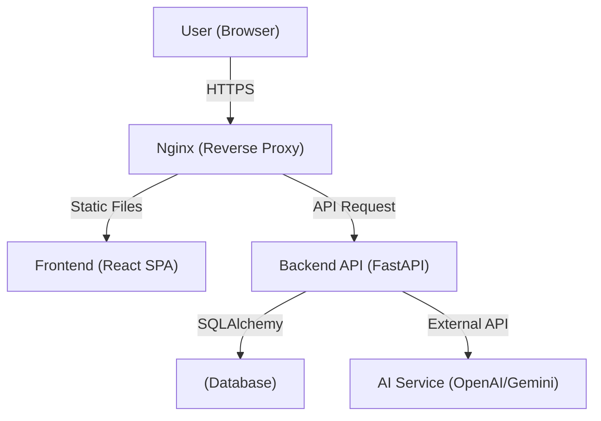

# HLD (High-Level Design) - Context Hunter

## 1. HLD의 목적
본 문서는 **Context Hunter** 시스템의 전체 구조를 조망하고, 아키텍처, 주요 모듈, 데이터 흐름을 상위 수준에서 정의하는 것을 목적으로 합니다. 개발자, PM, 고객 등 모든 이해관계자가 시스템의 구성을 명확히 이해할 수 있도록 작성되었습니다.

## 2. 시스템 개요 (System Overview)

### 2.1 시스템 목적
**Context Hunter**는 사용자가 문맥에 맞는 적절한 단어를 선택하거나 입력하여 문해력을 향상시킬 수 있는 웹 기반 게임 서비스입니다. 단순한 단어 암기가 아닌, 문맥적 의미를 파악하는 능력을 기르는 것을 목표로 합니다.

### 2.2 전체 기능 요약
*   **사용자 관리**: 회원가입, 로그인(JWT), 게스트 모드 지원
*   **게임 모드**:
    *   **일일 모드**: 매일 제공되는 10문제 풀이
    *   **도전 모드**: 무한 문제 풀이 (3회 오답 시 종료)
*   **AI 분석**: 사용자 답안의 문맥 유사도 분석 및 정답 판별 (Llama 3.1 8b & multilingual-e5-small 활용)
*   **학습 보조**: 오답 노트 저장 및 복습 기능
*   **랭킹 시스템**: 도전 모드 점수 기반 글로벌 랭킹 및 명예의 전당
*   **소셜 공유**: 게임 결과 공유 기능

### 2.3 사용자 유형 및 시나리오
*   **일반 사용자 (회원)**: 로그인 후 모든 게임 모드 이용, 오답 노트 저장, 랭킹 등록 가능
*   **게스트 사용자**: 로그인 없이 게임 플레이 가능, 랭킹 등록 및 오답 노트 저장 제한적 허용 (또는 불가)
*   **관리자**: 문제 데이터 관리 및 시스템 모니터링 (추후 확장 예정)

### 2.4 운영 환경
*   **Client**: 웹 브라우저 (Chrome, Safari, Edge 등 최신 브라우저)
*   **Server**: Linux/Windows 환경, Python Runtime
*   **Database**: SQLite (개발/로컬), MariaDB (운영)

## 3. 전체 아키텍처 (System Architecture)

### 3.1 전체 시스템 블록 다이어그램


### 3.2 계층 구조 (Layered Architecture)
*   **Presentation Layer (Frontend)**: React 기반의 SPA. 사용자 인터랙션 처리 및 UI 렌더링.
*   **Application Layer (Backend)**: FastAPI 기반의 RESTful API. 비즈니스 로직, 인증, 데이터 처리 담당.
*   **Data Layer (Database)**: 사용자 정보, 문제 데이터, 게임 기록 등을 저장하는 RDBMS.

## 4. 기술 스택 (Tech Stack)

### 4.1 언어 및 프레임워크
*   **Frontend**: TypeScript, React 19, Vite, Tailwind CSS 4
*   **Backend**: Python 3.x, FastAPI
*   **ORM**: SQLAlchemy

### 4.2 기술 선정 근거 (Trade-off Analysis)
*   **FastAPI vs Django**:
    *   **선정**: FastAPI
    *   **이유**: AI 서비스와의 비동기 통신 효율성, 높은 성능, 자동화된 API 문서(Swagger) 제공. Django는 기능이 강력하지만 본 프로젝트에는 과도하게 무겁고 동기 방식이 기본이라 제외.
*   **RDBMS (MariaDB) vs NoSQL**:
    *   **선정**: RDBMS
    *   **이유**: 사용자-오답노트-문제 간의 관계(Relation)가 명확하고, 데이터 무결성이 중요함. NoSQL의 유연성보다는 정형화된 데이터 구조가 적합.


### 4.2 데이터베이스
*   **Main DB**: SQLite (Development), MariaDB (Production)

### 4.3 외부 서비스
*   **AI Engine**: 
    *   **Generation & Verification**: Llama 3.1 8b (via OpenAI-compatible API)

### 4.4 외부 인터페이스 및 장애 대응 (External Interfaces)
*   **AI Service Communication**:
    *   **Protocol**: HTTPS (REST API)
    *   **Timeout**: 10초 (Generation), 5초 (Verification)
*   **Fallback Policy**:
    *   **API 장애 시**: 외부 AI API 호출 실패 시, 사용자에게 "AI 서비스 일시 장애" 메시지를 표시.
    *   **DB 장애 시**: 읽기 전용 모드로 전환하거나 점검 중 페이지 표시.


## 5. 데이터 흐름 (Data Flow)

### 5.1 주요 기능 단위 데이터 흐름 (정답 검증)
### 5.1 주요 기능 단위 데이터 흐름 (Data Flow Diagram)
```mermaid
flowchart TD
    User([User]) -->|1. Submit Answer| FE[Frontend]
    FE -->|2. POST /api/verify| BE[Backend API]
    
    subgraph Backend Services
        BE -->|3. Get Correct Meaning| DB[(Database)]
        BE -->|4. Request Verification| AI[AI Engine (Llama 3-1)]
        AI -- Similarity Score --> BE
        BE -->|5. Save Attempt Log| DB
    end
    
    BE -- 6. Result (Correct/Fail) --> FE
    FE -- 7. Display Feedback --> User
```


## 6. 주요 모듈 설명 (Key Modules)

### 6.1 Auth Module (인증)
*   **역할**: 사용자 회원가입, 로그인, 토큰 발급 및 검증
*   **입력**: 사용자 ID/PW
*   **출력**: JWT Access Token

### 6.2 Game Core Module (게임 로직)
*   **역할**: 문제 출제, 정답 검증, 점수 계산
*   **내부 동작**: 난이도별 문제 랜덤 추출, AI 기반 유사도 검사 로직 수행

### 6.3 Ranking Module (랭킹)
*   **역할**: 사용자 점수 집계 및 순위 제공
*   **관계**: `User` 및 `Guestbook` 테이블과 연동하여 Top N 리스트 반환

### 6.4 Note Module (오답 노트)
*   **역할**: 틀린 문제 저장 및 조회
*   **관계**: `User`와 `Question` 테이블을 연결하여 개인화된 학습 데이터 관리

## 7. 인터페이스 정의 (High-Level API)

| 구분 | Method | Endpoint | 설명 |
| :--- | :--- | :--- | :--- |
| **Auth** | POST | `/api/auth/login` | 로그인 및 토큰 발급 |
| **User** | GET | `/api/users/me` | 내 정보 조회 |
| **Game** | GET | `/api/questions` | 문제 목록 조회 |
| **Game** | POST | `/api/verify` | 정답 검증 요청 |
| **Note** | POST | `/api/notes` | 오답 노트 저장 |
| **Rank** | GET | `/api/rankings` | 랭킹 목록 조회 |

## 8. 성능/보안/확장성 고려

### 8.1 확장성 전략
*   **Stateless Backend**: REST API 구조로 서버 수평 확장(Scale-out) 용이 (Docker Replica 활용)
*   **Frontend 분리**: Nginx를 통한 정적 리소스 서빙 및 캐싱 최적화

### 8.2 보안 모델
*   **인증**: JWT(JSON Web Token) 기반의 Stateless 인증
*   **비밀번호**: Bcrypt 등을 이용한 단방향 해시 저장
*   **통신**: HTTPS 암호화 통신 권장

### 8.3 예상 성능
*   **목표 TPS**: 초기 단계에서는 동시 접속자 수 100명 수준 처리 목표
*   **응답 속도**: AI 분석을 제외한 일반 API 응답 200ms 이내 목표

## 9. 제한사항 및 가정
*   **AI 비용/자원**: 
    *   Llama 3.1: API 호출 비용 또는 호스팅 비용 발생
    *   Embedding: 로컬 서버 메모리(약 1GB) 및 CPU 자원 소모
*   **네트워크**: 문제 생성 시 인터넷 연결 필수 (로컬 임베딩은 오프라인 가능)
*   **브라우저**: 최신 모던 브라우저(ES6+ 지원) 환경 가정
