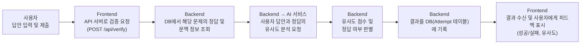
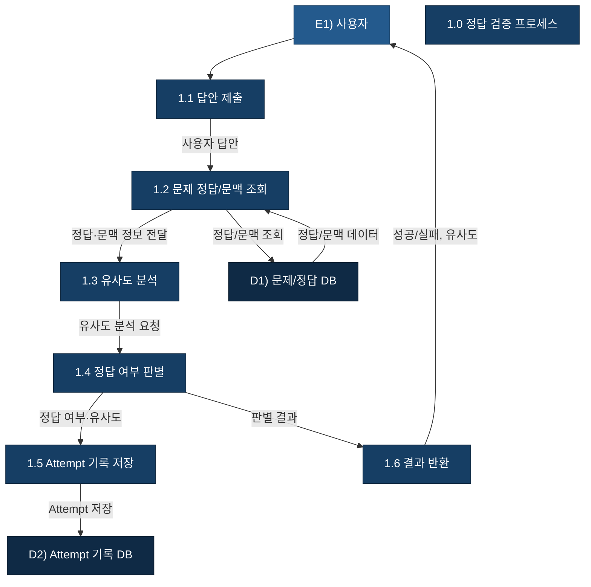

```mermaid
flowchart LR

    %% 노드 정의
    User["사용자<br>답안 입력 및 제출"]

    FE_Request["Frontend<br>API 서버로 검증 요청<br>(POST /api/verify)"]

    BE_Query["Backend<br>DB에서 해당 문제의 정답 및<br>문맥 정보 조회"]

    BE_AI["Backend → AI 서비스<br>사용자 답안과 정답의<br>유사도 분석 요청"]

    BE_Judge["Backend<br>유사도 점수 및<br>정답 여부 판별"]

    BE_Log["Backend<br>결과를 DB(Attempt 테이블)에 기록"]

    FE_Response["Frontend<br>결과 수신 및 사용자에게 피드백 표시<br>(성공/실패, 유사도)"]

    %% 흐름
    User --> FE_Request --> BE_Query --> BE_AI --> BE_Judge --> BE_Log --> FE_Response
```

```mermaid
flowchart TD

    %% 스타일 정의
    classDef process fill:#163E64,stroke:#0d253c,stroke-width:1px,color:#ffffff
    classDef datastore fill:#0F2A45,stroke:#0a1b2d,stroke-width:1px,color:#ffffff
    classDef external fill:#245A8D,stroke:#163E64,stroke-width:1px,color:#ffffff

    %% 외부 엔티티
    User["E1) 사용자"]:::external

    %% 상위 프로세스 (1.0 정답 검증)
    P1["1.0 정답 검증 프로세스"]:::process

    %% Level-1 하위 프로세스
    P1_1["1.1 답안 제출"]:::process
    P1_2["1.2 문제 정답/문맥 조회"]:::process
    P1_3["1.3 유사도 분석"]:::process
    P1_4["1.4 정답 여부 판별"]:::process
    P1_5["1.5 Attempt 기록 저장"]:::process
    P1_6["1.6 결과 반환"]:::process

    %% 데이터스토어
    DS_Problem["D1) 문제/정답 DB"]:::datastore
    DS_Attempt["D2) Attempt 기록 DB"]:::datastore

    %% 흐름 구성
    User --> P1_1

    P1_1 -->|"사용자 답안"| P1_2

    P1_2 -->|"정답/문맥 조회"| DS_Problem
    DS_Problem -->|"정답/문맥 데이터"| P1_2

    P1_2 -->|"정답·문맥 정보 전달"| P1_3

    P1_3 -->|"유사도 분석 요청"| P1_4

    P1_4 -->|"정답 여부·유사도"| P1_5

    P1_5 -->|"Attempt 저장"| DS_Attempt

    P1_4 -->|"판별 결과"| P1_6
    P1_6 -->|"성공/실패, 유사도"| User
```
