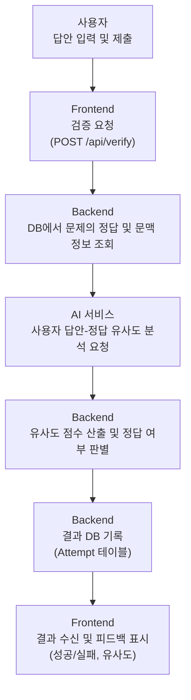

```mermaid
flowchart TD

    User["사용자<br>답안 입력 및 제출"]

    FE_Request["Frontend<br>검증 요청<br>(POST /api/verify)"]

    BE_Start["Backend<br>DB에서 문제의 정답 및 문맥 정보 조회"]

    BE_AI["AI 서비스<br>사용자 답안-정답 유사도 분석 요청"]

    BE_Result["Backend<br>유사도 점수 산출 및 정답 여부 판별"]

    BE_Log["Backend<br>결과 DB 기록<br>(Attempt 테이블)"]

    FE_Response["Frontend<br>결과 수신 및 피드백 표시<br>(성공/실패, 유사도)"]

    User --> FE_Request --> BE_Start --> BE_AI --> BE_Result --> BE_Log --> FE_Response
```
