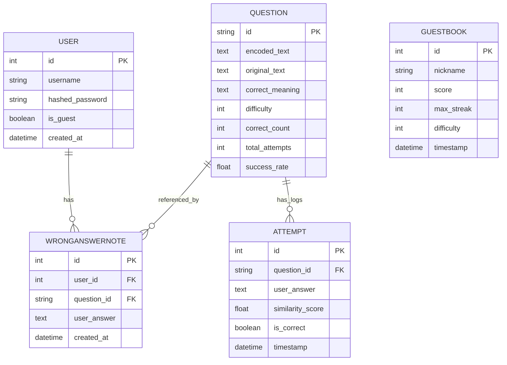
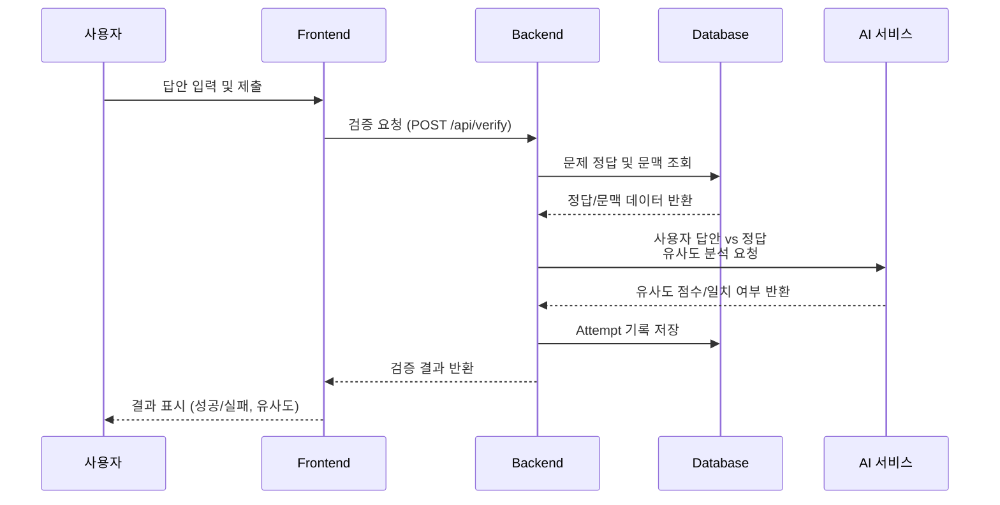
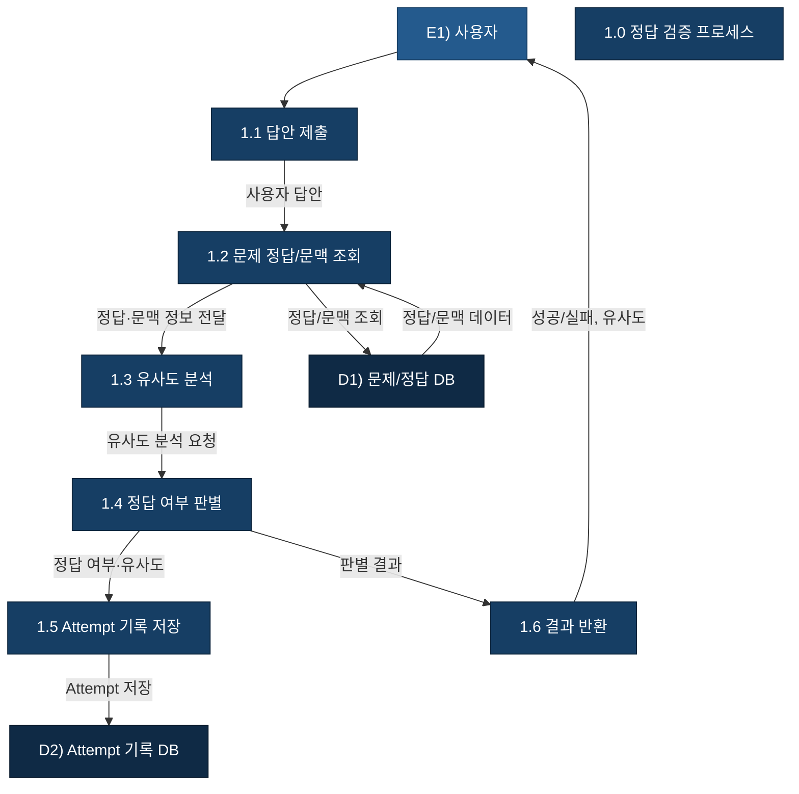

```mermaid
erDiagram

    USER {
        int id PK
        string username
        string hashed_password
        boolean is_guest
        datetime created_at
    }

    QUESTION {
        string id PK
        text encoded_text
        text original_text
        text correct_meaning
        int difficulty
        int correct_count
        int total_attempts
        float success_rate
    }

    WRONGANSWERNOTE {
        int id PK
        int user_id FK
        string question_id FK
        text user_answer
        datetime created_at
    }

    ATTEMPT {
        int id PK
        string question_id FK
        text user_answer
        float similarity_score
        boolean is_correct
        datetime timestamp
    }

    GUESTBOOK {
        int id PK
        string nickname
        int score
        int max_streak
        int difficulty
        datetime timestamp
    }

    %% 관계 정의 (1:N)
    USER ||--o{ WRONGANSWERNOTE : "has"
    QUESTION ||--o{ WRONGANSWERNOTE : "referenced_by"
    QUESTION ||--o{ ATTEMPT : "has_logs"
```

```mermaid
sequenceDiagram
    participant U as 사용자
    participant F as Frontend
    participant B as Backend
    participant DB as Database
    participant AI as AI 서비스

    U->>F: 답안 입력 및 제출
    F->>B: 검증 요청 (POST /api/verify)

    B->>DB: 문제 정답 및 문맥 조회
    DB-->>B: 정답/문맥 데이터 반환

    B->>AI: 사용자 답안 vs 정답<br>유사도 분석 요청
    AI-->>B: 유사도 점수/일치 여부 반환

    B->>DB: Attempt 기록 저장

    B-->>F: 검증 결과 반환
    F-->>U: 결과 표시 (성공/실패, 유사도)
```

```mermaid
flowchart TD

    %% 스타일 정의
    classDef process fill:#163E64,stroke:#0d253c,stroke-width:1px,color:#ffffff
    classDef datastore fill:#0F2A45,stroke:#0a1b2d,stroke-width:1px,color:#ffffff
    classDef external fill:#245A8D,stroke:#163E64,stroke-width:1px,color:#ffffff

    %% 외부 엔티티
    User["E1) 사용자"]:::external

    %% 상위 프로세스 (1.0 정답 검증)
    P1["1.0 정답 검증 프로세스"]:::process

    %% Level-1 하위 프로세스
    P1_1["1.1 답안 제출"]:::process
    P1_2["1.2 문제 정답/문맥 조회"]:::process
    P1_3["1.3 유사도 분석"]:::process
    P1_4["1.4 정답 여부 판별"]:::process
    P1_5["1.5 Attempt 기록 저장"]:::process
    P1_6["1.6 결과 반환"]:::process

    %% 데이터스토어
    DS_Problem["D1) 문제/정답 DB"]:::datastore
    DS_Attempt["D2) Attempt 기록 DB"]:::datastore

    %% 흐름 구성
    User --> P1_1

    P1_1 -->|"사용자 답안"| P1_2

    P1_2 -->|"정답/문맥 조회"| DS_Problem
    DS_Problem -->|"정답/문맥 데이터"| P1_2

    P1_2 -->|"정답·문맥 정보 전달"| P1_3

    P1_3 -->|"유사도 분석 요청"| P1_4

    P1_4 -->|"정답 여부·유사도"| P1_5

    P1_5 -->|"Attempt 저장"| DS_Attempt

    P1_4 -->|"판별 결과"| P1_6
    P1_6 -->|"성공/실패, 유사도"| User
```
