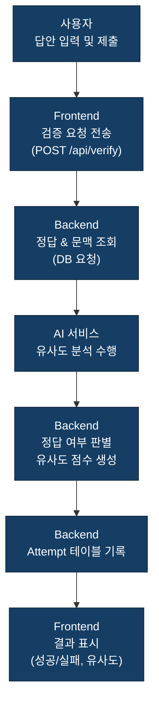
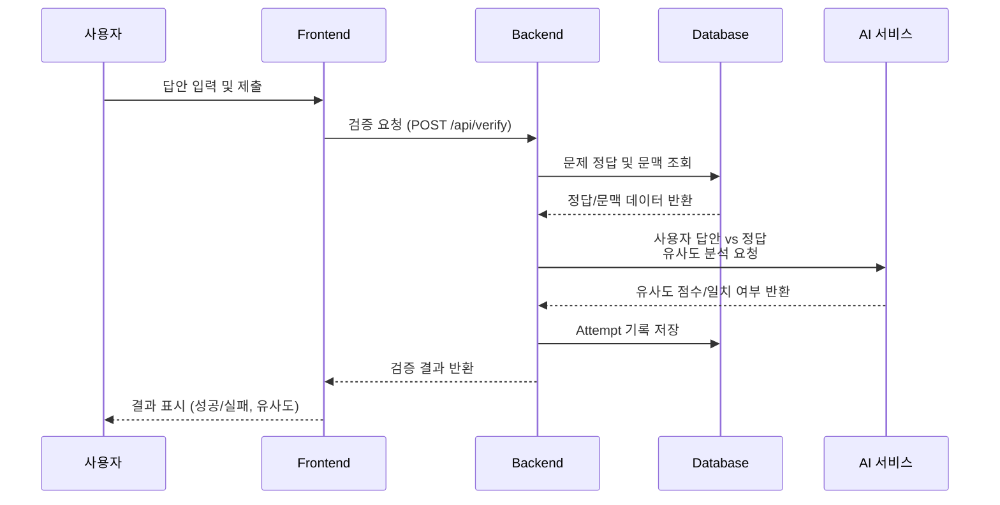

```mermaid
flowchart TD

    classDef box fill:#163E64,stroke:#0d253c,stroke-width:1px,color:#ffffff

    User["사용자<br>답안 입력 및 제출"]:::box

    FE["Frontend<br>검증 요청 전송<br>(POST /api/verify)"]:::box

    BE_Query["Backend<br>정답 & 문맥 조회<br>(DB 요청)"]:::box

    AI["AI 서비스<br>유사도 분석 수행"]:::box

    BE_Judge["Backend<br>정답 여부 판별<br>유사도 점수 생성"]:::box

    BE_Save["Backend<br>Attempt 테이블 기록"]:::box

    FE_Return["Frontend<br>결과 표시<br>(성공/실패, 유사도)"]:::box

    User --> FE --> BE_Query --> AI --> BE_Judge --> BE_Save --> FE_Return
```

```mermaid
sequenceDiagram
    participant U as 사용자
    participant F as Frontend
    participant B as Backend
    participant DB as Database
    participant AI as AI 서비스

    U->>F: 답안 입력 및 제출
    F->>B: 검증 요청 (POST /api/verify)

    B->>DB: 문제 정답 및 문맥 조회
    DB-->>B: 정답/문맥 데이터 반환

    B->>AI: 사용자 답안 vs 정답<br>유사도 분석 요청
    AI-->>B: 유사도 점수/일치 여부 반환

    B->>DB: Attempt 기록 저장

    B-->>F: 검증 결과 반환
    F-->>U: 결과 표시 (성공/실패, 유사도)
```
