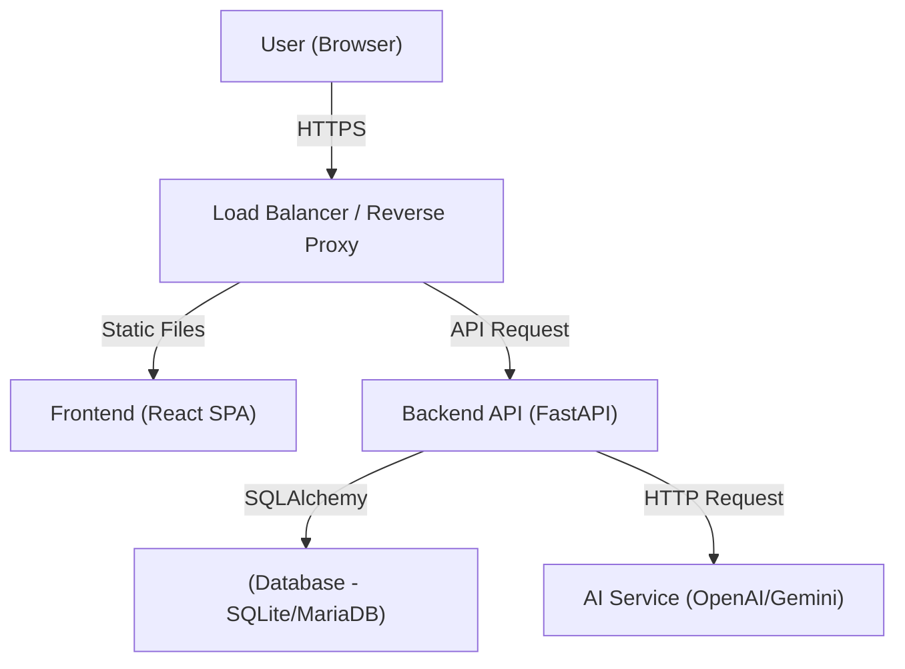
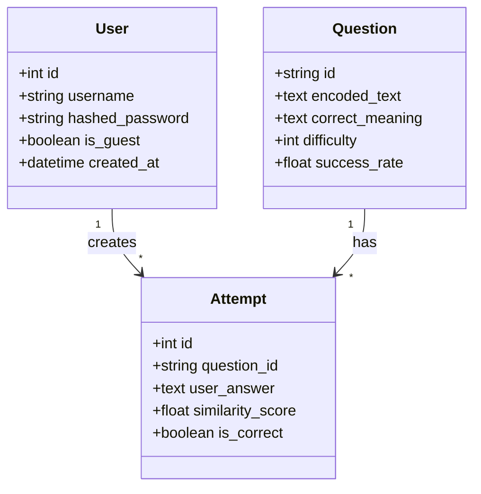
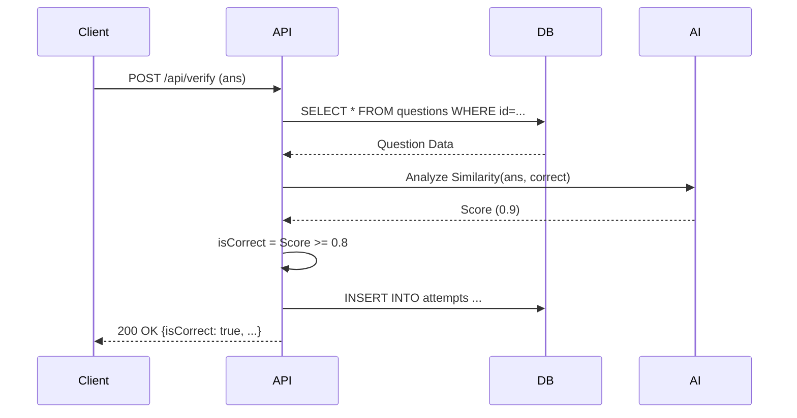

# Context Hunter - System Design Document (HLD & LLD)

## ✅ HLD (High-Level Design) 문서

### 1. HLD의 목적
본 문서는 **Context Hunter** 시스템의 전체 구조를 한눈에 이해할 수 있도록 제공하는 것을 목적으로 합니다. 아키텍처, 주요 모듈, 데이터 흐름 등을 상위 수준에서 설명하여 개발자, PM, 고객 등 모든 이해관계자가 시스템 구성을 명확히 이해할 수 있도록 작성되었습니다.

### 2. 시스템 개요 (System Overview)
*   **시스템 목적**: 사용자가 문맥에 맞는 적절한 단어를 선택하거나 입력하여 문해력을 향상시킬 수 있는 웹 기반 게임 서비스 제공. 단순 암기가 아닌 문맥적 의미 파악 능력 배양.
*   **전체 기능 요약**:
    *   **사용자 관리**: 회원가입, 로그인(JWT), 게스트 모드
    *   **게임 플레이**: 일일 모드(10문제), 도전 모드(무한/3Life)
    *   **AI 분석**: 답안 유사도 분석 및 문제 생성 (Llama 3.1 8b via API)
    *   **학습 보조**: 오답 노트, 랭킹 시스템, 소셜 공유
*   **사용자 유형 및 시나리오**:
    *   **일반 사용자**: 로그인 후 기록 저장, 랭킹 경쟁, 오답 복습
    *   **게스트**: 로그인 없이 가볍게 게임 체험 (기록 저장 제한)
*   **운영 환경**:
    *   **Client**: Modern Web Browser (Chrome, Edge, Safari 등)
    *   **Server**: Python Runtime (Windows/Linux)
    *   **Network**: 인터넷 연결 필수 (AI API 통신)

### 3. 전체 아키텍처 (System Architecture)
*   **전체 시스템 블록 다이어그램**:

*   **계층 구조**:
    *   **Frontend**: React, TypeScript, Tailwind CSS (UI/UX 담당)
    *   **Backend**: FastAPI, Pydantic (비즈니스 로직, API 제공)
    *   **Database**: SQLite/MariaDB (데이터 영구 저장)

### 4. 기술 스택 (Tech Stack)
*   **언어 / 프레임워크**:
    *   Frontend: TypeScript, React 19, Vite
    *   Backend: Python 3.x, FastAPI
*   **데이터베이스**: SQLite (개발), MariaDB (운영)
*   **메시징 시스템**: (현재 미사용, 추후 Redis 도입 고려)
*   **AI Engine**: 
    *   **Generation & Embedding**: Llama 3.1 8b (All via OpenAI-compatible API)

### 5. 데이터 흐름 (Data Flow)
*   **사용자 요청 → 처리 → 응답 흐름 (정답 검증 예시)**:
    1.  **User**: 답안 입력 및 제출
    2.  **Frontend**: `POST /api/verify` 요청 전송
    3.  **Backend**: DB에서 정답 조회 -> AI API 호출로 유사도 분석 및 정답 판별 -> DB 저장
    4.  **Frontend**: 결과(정답/오답, 유사도) 수신 및 UI 표시

### 6. 주요 모듈 설명 (Key Modules)
*   **Auth Module**: 사용자 인증/인가 담당. (Input: ID/PW, Output: JWT Token)
*   **Game Core Module**: 문제 출제 및 정답 검증 로직. (Input: User Answer, Output: Score/Feedback)
*   **Ranking Module**: 점수 집계 및 순위 산정. (Role: Leaderboard 관리)
*   **Note Module**: 오답 데이터 관리. (Role: 개인화 학습 데이터 저장)

### 7. 인터페이스 정의 (High-Level API)
*   **Auth**: `/api/auth/*` (로그인, 회원가입, 게스트)
*   **Game**: `/api/questions` (문제 조회), `/api/verify` (검증)
*   **User**: `/api/users/me` (내 정보), `/api/notes` (오답노트)
*   **Rank**: `/api/rankings` (랭킹 조회), `/api/guestbook` (기록 저장)

### 8. 성능/보안/확장성 고려
*   **확장성 전략**: Backend API의 Stateless 설계로 수평 확장 용이.
*   **보안 모델**:
    *   **인증**: JWT 기반 Bearer Token 인증.
    *   **인가**: 일반 유저 vs 게스트 권한 분리.
*   **예상 성능**: 동시 접속 100명 수준에서 응답 속도 200ms 이내 (AI 분석 제외).

### 9. 제한사항 및 가정
*   **제한사항**: AI API 호출 비용 및 속도 이슈 발생 가능 (캐싱 필요).
*   **가정**: 사용자는 최신 브라우저를 사용하며, 안정적인 인터넷 환경에 있다.

---

## ✅ LLD (Low-Level Design) 문서

### 1. LLD의 목적
개발자가 바로 코딩할 수 있도록 구현 상세를 제공합니다. 클래스, 함수, DB 스키마, 오류 처리 등을 구체적으로 정의합니다.

### 2. 클래스/모듈 상세 디자인 (Class/Module Design)
*   **Backend Class Diagram (SQLAlchemy Models)**:

*   **책임**:
    *   `User`: 사용자 계정 및 인증 정보 관리.
    *   `Question`: 문제 데이터 및 정답 정보 관리.
    *   `Attempt`: 사용자의 문제 풀이 이력 및 분석 결과 저장.

### 3. API 상세 설계 (API Specifications)

#### 3.1 Auth API
*   **POST /api/auth/login**
    *   **Request Body**: `username` (str), `password` (str)
    *   **Response**: `{ "access_token": "...", "token_type": "bearer" }`
    *   **Error**: 401 (Incorrect username or password)
    *   **Validation**: username/password 필수.

#### 3.2 Game API
*   **POST /api/verify**
    *   **Request Body**: `{ "questionId": "q1", "userAnswer": "..." }`
    *   **Response**: `{ "isCorrect": true, "similarity": 0.95, "feedback": "Good!" }`
    *   **Logic**:
        1.  DB에서 `questionId` 조회.
        2.  `userAnswer` 전처리 (trim).
        3.  AI 유사도 분석 수행.
        4.  유사도 >= 80% 이면 정답 처리.

### 4. 시퀀스 다이어그램 (Detailed Sequence)


### 5. DB 상세 설계 (Database Schema)
*   **users Table**:
    *   `id`: Integer, PK, Auto Increment
    *   `username`: Varchar(50), Unique, Nullable (Guest)
    *   `hashed_password`: Varchar(255)
    *   `is_guest`: Boolean, Default False
*   **questions Table**:
    *   `id`: Varchar(50), PK
    *   `correct_meaning`: Text, Not Null
    *   `difficulty`: Integer, Default 1
*   **attempts Table**:
    *   `id`: Integer, PK
    *   `similarity_score`: Float
    *   `is_correct`: Boolean

### 6. 알고리즘/로직 상세 (Algorithm & Logic)
*   **정답 유사도 분석 (Pseudocode)**:
    ```python
    def verify_answer(user_answer, correct_meaning):
        # 1. AI Analysis (multilingual-e5-small)
        try:
            # backend/ai.py의 check_similarity 호출 (Llama 3.1 API)
            result = check_similarity(user_answer, correct_meaning)
            score = result['similarity_score']
            is_correct = result['is_correct']
        except:
            # Fallback (if model fails to load)
            score = 0
            is_correct = False
            
        return score, is_correct
    ```

### 7. 상태 정의 (State Definitions)
*   **Game State (Frontend)**:
    *   `IDLE`: 대기 상태
    *   `PLAYING`: 문제 풀이 중
    *   `LOADING`: API 요청 중 (검증/로딩)
    *   `FINISHED`: 결과 화면 표시

### 8. 구성 파일/환경 변수 (Config & Env)
*   **.env File**:
    *   `SECRET_KEY`: JWT 서명 키 (필수)
    *   `DATABASE_URL`: DB 연결 URL (예: `sqlite:///./app.db`)
    *   `OPENAI_API_KEY`: AI API 키 (Llama 3.1 사용 시)
    *   `AI_BASE_URL`: AI API Base URL (예: Groq, Ollama 등)
    *   `AI_MODEL_NAME`: 사용할 모델명 (Default: llama-3.1-8b-instant)
*   **Port**: Backend 8001 (Default), Frontend 5173 (Vite Default)

### 9. 보안 세부 구현 (Security Detail)
*   **토큰 생성**: `python-jose` 라이브러리 사용, `HS256` 알고리즘. Payload에 `sub: username` 포함.
*   **암호화**: `passlib[bcrypt]` 사용하여 비밀번호 단방향 해시 저장.
*   **로그 정책**: 주요 에러 및 API 호출 정보는 `debug.log` 파일에 기록 (운영 시 Log Rotation 적용 필요).
