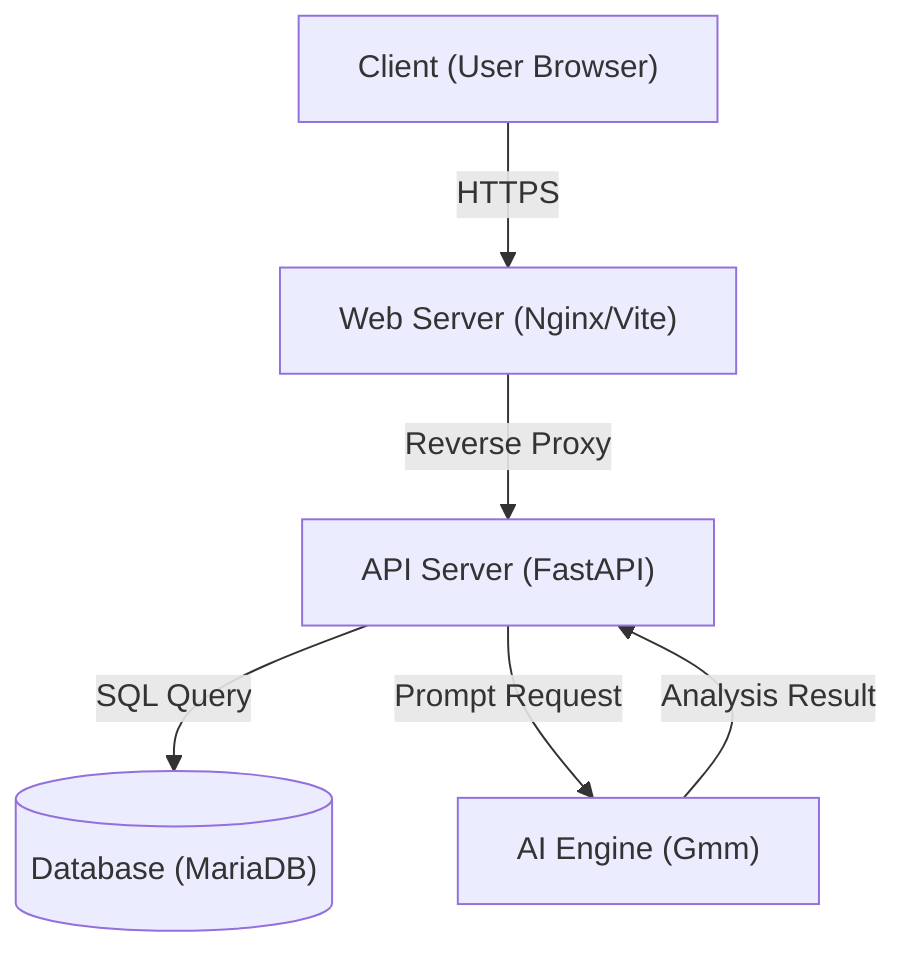

# Context Hunter - 최종 결과 보고서

> 전체적으로 발표 시 사용했던 내용들을 추가해야 함

> **문서 개요**
> 본 보고서는 **Context Hunter** 프로젝트의 기획 의도부터 기술적 구현 상세, 그리고 개발 과정에서의 시행착오까지 모든 내용을 **글로 읽어서 이해할 수 있도록 상세히 기술**하였습니다. 발표 자료보다 더 심도 있는 내용을 담고 있습니다.

---

## 1. 배경 및 개발 동기 (Background & Motivation)

### 1.1 개발 배경: '실질적 문맹(Functional Illiteracy)'의 역설
현대 사회는 디지털 기기의 보급으로 텍스트 소비량 자체는 폭발적으로 증가했습니다. 그러나 **'글자를 읽을 줄 아는(Basic Literacy)'** 능력과 **'글의 속뜻과 맥락을 파악하는(Substantive Literacy)'** 능력 사이의 괴리는 점점 커지고 있습니다.

*   **OECD 통계의 경고**: OECD가 주관한 국제 성인 역량 조사(PIAAC)에 따르면, 한국 청년층(16~24세)의 문해력은 OECD 상위권이나, 연령이 높아질수록 급격히 하락하는 양상을 보입니다. 더 심각한 것은 긴 줄글이나 복잡한 표를 해석해야 하는 **'고급 문해력'** 영역에서 오독률이 증가하고 있다는 점입니다.
*   **디지털 패러독스**: 숏폼(Short-form) 콘텐츠와 3줄 요약 문화에 익숙해진 현대인들은 '긴 호흡의 글'을 읽고 추론하는 뇌 근육이 퇴화하고 있습니다. 이는 단순한 학습 부족이 아닌, 매체 환경 변화에 따른 구조적인 문제입니다.

> **이거 근거 확실한지 확인 한 번만 해줘**

### 1.2 기존 솔루션의 한계점 (Problem Statement)
현재 시장에 나와 있는 성인용 문해력/어휘력 솔루션들은 다음과 같은 명확한 한계를 가집니다.

1.  **수동적 학습(Passive Learning)**: 단순히 단어와 뜻을 암기하고 O/X 퀴즈를 푸는 방식은, 실제 문맥에서의 활용 능력을 길러주지 못합니다.
2.  **경직된 피드백(Rigid Feedback)**: 사용자가 자신의 생각대로 답을 적으면, 정해진 정답지와 글자 하나라도 틀릴 경우 오답 처리됩니다. 이는 학습자의 사고 확장을 가로막는 가장 큰 장애물입니다. (예: "배가 고프다" ≠ "식사하고 싶다")
3.  **동기 부여 결여(Lack of Motivation)**: "공부는 지루한 것"이라는 인식을 깨지 못하여, 앱 설치 후 일주일 내 이탈률이 매우 높습니다.

> 가능하면 이전 발표 자료에 사용했던 Sementic 등으로 대체

### 1.3 개발 동기 및 목표: "Context Hunter"
우리는 **"능동적 추론(Active Reasoning)"**과 **"게이미피케이션(Gamification)"**을 결합하여 이 문제를 해결하고자 했습니다.

*   **Goal 1. 문맥 사냥꾼**: 단순히 단어를 외우는 것이 아니라, 숨겨진 의미(Context)를 사냥하듯 찾아내는 능동적 경험을 제공합니다.
*   **Goal 2. AI 교사**: 정해진 정답 대신, AI가 사용자의 의도를 분석하여 "당신의 말이 일리가 있다"고 인정해주는 유연한 멘토링 시스템을 구축합니다.
*   **Goal 3. 지속 가능한 재미**: 학습 보상으로 나만의 테마를 꾸미고 랭킹 경쟁을 하는 등, 게임적 요소를 통해 자연스럽게 학습 지속성을 확보합니다.

---

## 2. 관련 기술 및 연구 조사 (Related Technology & Research)

본 프로젝트의 성공적인 구현을 위해 최신 웹 기술 트렌드와 LLM(Generative AI) 활용 전략을 심도 있게 조사하고 적용했습니다.

### 2.1 프론트엔드: React 19 & Tailwind CSS 4.0
- **React 19**: 최신 Concurrent Rendering 기능과 개선된 Hook 시스템을 활용하여, AI 응답 대기 시간 동안에도 UI가 멈추지 않는(Non-blocking) 부드러운 사용자 경험을 제공합니다. 특히 `useTransition` 등을 통해 사용자 인터랙션 반응성을 극대화했습니다.
- **Tailwind CSS 4.0**: 기존 CSS-in-JS의 런타임 오버헤드를 제거한 Zero-runtime 스타일링 도구입니다. JIT(Just-In-Time) 컴파일러를 통해 테마 변경 시에도 즉각적인 스타일 렌더링이 가능하여, 본 프로젝트의 핵심인 '테마 상점' 구현에 최적화되었습니다.

### 2.2 백엔드: FastAPI & Python Concurrency
- **FastAPI**: 기존 Flask나 Django와 달리 비동기(Asynchronous) 및 병렬 처리가 뛰어납니다. AI API 호출과 같은 I/O Bound 작업이 빈번한 본 서비스 특성상, 동시 접속자가 늘어나도 서버가 멈추지 않고 효율적으로 요청을 처리할 수 있는 고성능 프레임워크입니다.
- **SQLAlchemy (ORM)**: 데이터베이스 스키마와 Python 객체를 1:1로 매핑하여, 복잡한 SQL 쿼리 없이도 객체 지향적인 코드로 데이터 조작이 가능하게 하여 유지보수성을 높였습니다.

### 2.3 AI 엔진: Gemma2 & LLM Research
- **모델 선정 배경 (Model Selection)**: 초기에는 Llama 2, GPT-3.5 등을 고려했으나, 한국어 문맥 이해도와 비용 효율성 측면에서 **Alibaba Cloud의 Qwen 2.5 7b** 모델이 가장 우수한 성능을 보였습니다. 특히 7B 파라미터 사이즈는 학생 개발 환경에서 1~2초 내 응답을 보장하는 최적의 크기입니다.

> Gemma2로 모델 전부 변경

- **Semantic Analysis (의미 분석)**: 기존의 단순 임베딩(Cosine Similarity) 방식은 문맥의 미묘한 차이를 놓치는 경우가 많았습니다. 이에 우리는 LLM에게 두 문장의 '의도적 등가성'을 판단하게 하는 **GenAI-based Evaluation** 방식을 채택했습니다. 이는 사람이 채점하는 것과 가장 유사한 결과를 제공합니다.

### 2.4 데이터베이스: 관계형 데이터베이스 (RDBMS)
- **MariaDB/SQLite**: 사용자(User)가 여러 문제(Question)를 풀고, 여러 테마(Theme)를 소유하는 등 데이터 간의 관계(Relation)가 명확하므로, NoSQL보다는 데이터 무결성을 보장하는 RDBMS를 선택했습니다.

---

## 3. 제안 아이디어 및 차별성 (Proposed Idea & Differentiation)

### 3.1 아이디어 요약
**Context Hunter**는 "문맥을 사냥한다"는 컨셉의 **AI 기반 문해력 액션 게임**입니다.
정치, 경제 등 난해한 텍스트 속에 숨겨진 '속뜻'을 찾아내는 과정을 게임화하였으며, 사용자의 답변을 AI가 실시간으로 분석하여 **"말이 통하면 정답"**으로 인정하는 유연한 평가 시스템을 제공합니다. 이는 기존의 경직된 암기식 학습을 **'능동적 추론'**의 영역으로 확장시킨 혁신적인 에듀테크 솔루션입니다.

### 3.2 기존 시스템과의 차별성 (Differentiation)
기존의 단어 암기 앱(예: Quizlet, 듀오링고 등)이나 문해력 문제집과 비교했을 때, Context Hunter는 다음과 같은 확실한 차별점을 가집니다.

| 비교 항목 | 기존 솔루션 (Legacy Apps) | **Context Hunter (Proposed)** |
| :--- | :--- | :--- |
| **학습 방식** | **수동적 암기** (Flashcards)   단어와 뜻을 1:1로 매칭 | **능동적 추론** (Inference)   문장 전체의 맥락을 읽고 해석 |
| **평가 방식** | **String Match** (텍스트 일치)   "배가 고프다" ≠ "식사하고 싶다" (오답) | **Semantic Analysis** (의미 분석)   "배가 고프다" = "식사하고 싶다" (정답) |
| **동기 부여** | **의무감** (Duty)   "오늘도 공부해야 해" (지루함) | **성취감** (Achievement)   "상점에서 테마 사야지" (즐거움) |
| **콘텐츠** | **유한함** (Fixed DB)   사람이 입력한 문제만 풀 수 있음 | **무한함** (Generative AI)   AI가 Seed Word로 무한히 문제 생성 |

### 3.3 3대 핵심 가치
1.  **Fun (Game-centric)**: 3-Life 도전 모드, 실시간 글로벌 랭킹, 테마 상점 등 게임의 문법을 그대로 따릅니다.
2.  **Context (Deep-dive)**: 단순 어휘가 아닌, 실제 기사/칼럼 수준의 문장력을 기릅니다.
3.  **AI (Flexibility)**: Gemma2 모델을 통해 사람 같은 피드백을 제공합니다.

---

## 4. 시스템 설계 (System Design)

### 4.1 High-Level Design (HLD)
전체 시스템은 **Client-Server 구조**를 따르며, AI 엔진을 별도의 모듈로 분리하여 유연성을 확보했습니다.

*   **Frontend (SPA)**: React 기반의 싱글 페이지 애플리케이션으로, 사용자의 인터랙션과 상태 관리(게임 진행, 상점 구매 등)를 담당합니다.
*   **Backend (REST API)**: 비즈니스 로직을 처리하며, 특히 **AI와의 통신(Prompt Injection & Parsing)**을 전담하여 클라이언트가 무거운 AI 로직을 알 필요가 없도록 추상화했습니다.
*   **AI Service**: 외부 API(OpenAI protocol)를 통해 LLM과 통신합니다. 서버는 AI의 응답을 JSON으로 확실하게 파싱하여 클라이언트에 전달합니다.

### 4.2 Low-Level Design (LLD)

#### 4.2.1 데이터베이스 스키마 (Database Schema)
핵심 엔티티인 사용자, 문제, 그리고 방명록(랭킹)의 구조는 다음과 같습니다.

| Table | Column | Description |
| :--- | :--- | :--- |
| **Users** | `id`, `username`, `password_hash` | 사용자 기본 정보 |
| | `credits`, `equipped_theme`, `owned_themes` | **게이미피케이션 데이터** (재화, 아이템) |
| **Questions** | `id`, `category`, `difficulty` | 문제 메타데이터 |
| | `encoded_text`, `correct_meaning` | AI가 생성한 문제 본문 및 정답 가이드 |
| **Guestbook** | `id`, `nickname`, `score`, `max_streak` | **랭킹 시스템**을 위한 비회원/회원 통합 기록 |
| **DailyProgress** | `user_id`, `date`, `cleared_domains` | 일일 도전 과제 달성 여부 추적 |

#### 4.2.2 핵심 API 명세 (Key API Endpoints)
*   `GET /api/questions`: 난이도와 카테고리에 맞는 문제를 AI가 생성하거나 DB에서 조회하여 반환합니다.
*   `POST /api/verify`: 사용자의 답안과 문제 ID를 전송하면, AI를 통해 0~100점의 유사도 점수와 피드백을 반환합니다.
*   `POST /api/shop/buy`: 사용자의 크레딧을 차감하고 테마 소유권을 등록합니다. (Transaction 보장)
*   `GET /api/rankings`: 점수 내림차순으로 상위 10명의 랭킹 정보를 실시간으로 조회합니다.

---

## 5. AI 구현 상세 및 최적화 (AI Strategy)

### 5.1 문제 생성 (Auto-Generation) 매커니즘
사람이 일일이 문제를 출제하는 것은 한계가 있습니다. 저희는 **'Seed Word' 기반의 생성 방식**을 택했습니다.
1.  **Word Database**: 정치, 경제, 사회 등 6개 분야별 고난이도 어휘(예: '파행', '기인', '형해화' 등)를 DB에 미리 구축합니다.
2.  **Prompt Injection**: AI에게 *"이 단어를 포함하여, 중장년층이 읽을 법한 난이도의 비유적인 문장을 만들어라"*라는 구체적인 페르소나를 부여합니다.
3.  **Result**: 이를 통해 매번 뉘앙스가 다른 무한한 문제가 실시간으로 생성됩니다.

### 5.2 의미 유사도 판단 (Semantic Evaluation)
가장 기술적으로 난이도가 높았던 부분입니다.
- **기존 방식**: 텍스트 코사인 유사도(Embedding)만 쓰면, 단어는 다르지만 뜻이 같은 경우를 잘 잡아내지 못합니다.
- **우리의 방식**: LLM에게 **"두 문장의 '의도'가 동일한지 0~100점으로 평가하라"**는 지시를 내립니다. 또한 응답을 반드시 **JSON 포맷**으로 출력하게 강제하여, 서버에서 파싱 오류 없이 정확한 점수를 추출합니다.

---

## 6. 구현 기능 상세 (Features)

### 6.1 게임 모드
- **일일 모드 (Daily)**: 하루 5문제, 가볍게 문해력을 체크합니다. 클리어 시 크레딧 보상이 주어집니다.
- **도전 모드 (Challenge)**: **하트 3개(Life)** 시스템이 적용됩니다. 오답 시 하트가 줄어들며 0개가 되면 게임 오버입니다. 연속 정답 시 **'콤보(Streak)'** 보너스가 있어 긴장감을 줍니다.

### 6.2 상점 및 테마 시스템 (Gamification)
단순히 배경 이미지만 바꾸는 것이 아닙니다.
- **테마별 분위기**: '사이버펑크' 테마는 매트릭스 코드 레인 효과, '봄' 테마는 벚꽃이 떨어지는 파티클 효과 등 **동적인 시각 효과**를 구현했습니다.
- **동사적 보상**: "공부했다"가 아니라 "게임을 해서 아이템을 샀다"는 성취감을 주어 재방문을 유도합니다.

### 6.3 데이터 흐름 (Data Flow)
1. 답안 제출 -> 2. 백엔드 수신 (JWT 토큰 검증) -> 3. AI 분석 요청 (약 1~2초 소요) -> 4. 결과(점수/피드백) 반환 -> 5. 점수에 따라 사용자 DB 업데이트 (크레딧/랭킹)

---

## 7. 핵심 기능 시연 (Demonstration)

### 7.1 로그인 및 메인 화면
사용자 접근성을 높이기 위해 직관적인 UI를 구성했습니다.
*   **[이미지 삽입: 로그인 후 메인 대시보드 화면 캡처]**
    *   *설명: 로그인 직후 사용자는 '일일 도전'과 '무한 도전' 중 하나를 선택할 수 있습니다.*

### 7.2 게임 플레이 및 AI 피드백
실제 게임 진행 과정과 AI의 실시간 분석 화면입니다.
*   **[이미지 삽입: 문제 풀이 화면 및 AI 로딩/결과 피드백 캡처]**
    *   *설명: 사용자가 답을 입력하면 "AI가 분석 중입니다..." 문구와 함께 로딩 바가 표시되며, 약 1.5초 후 유사도 점수와 정답 여부가 표시됩니다.*

### 7.3 상점 및 테마 적용
게이미피케이션의 핵심인 상점과 테마 변경 기능입니다.
*   **[이미지 삽입: 상점 페이지에서 테마를 구매하거나 적용한 화면]**
    *   *설명: 획득한 크레딧으로 '사이버펑크', '봄' 등 다양한 테마를 구매할 수 있습니다. 적용 시 배경에 역동적인 파티클 효과가 나타납니다.*

### 7.4 실시간 랭킹 시스템 (Leaderboard)
사용자 간 경쟁을 유도하는 랭킹 화면입니다.
*   **[이미지 삽입: 랭킹 페이지 화면 캡처]**
    *   *설명: 모든 사용자의 최고 기록이 실시간으로 집계되어 순위표에 나타납니다. 1~3위는 특별한 강조 표시가 있어 도전 욕구를 자극합니다.*

### 7.5 오답 노트 (Review)
틀린 문제를 다시 학습할 수 있는 교육적 기능입니다.
*   **[이미지 삽입: 오답 노트 목록 화면 캡처]**
    *   *설명: 사용자가 틀렸던 문제와 정답 해설이 자동으로 저장되어, 학습 후 언제든 복습할 수 있습니다.*

---

## 8. 개발 과정의 난관 및 해결 (Challenges & Solutions)

### 8.1 프롬프트 제어의 어려움 (Prompt Engineering)
- **문제**: 초기 AI 모델은 사용자가 엉뚱한 답을 해도 "창의적이네요"라며 정답 처리하는 환각(Hallucination) 증세를 보였습니다.
- **해결**: AI에게 **"너는 엄격한 언어 교사다. 오타는 봐주되 의미가 다르면 0점을 줘라"**라는 강력한 **System Prompt**를 주입했습니다. 또한 수십 번의 테스트 케이스를 통해 임계값(Threshold)을 50점으로 튜닝했습니다.

### 8.2 응답 속도 (Latency)
- **문제**: LLM API 호출에 1~2초가 소요되어 사용자가 "멈췄다"고 느길 수 있었습니다.
- **해결**: 프론트엔드에서 **"AI가 분석 중입니다..."**라는 애니메이션 로딩 인디케이터를 추가했습니다. 오히려 이 짧은 대기 시간이 "AI가 내 글을 정말로 읽고 있구나"라는 신뢰감을 주는 장치로 작용했습니다.

---

## 9. 프로젝트 수행 환경 및 역할 분담 (Environment & Roles)

### 9.1 개발 환경 (Development Environment)
본 프로젝트는 협업 효율성을 극대화하기 위해 다음과 같은 환경에서 진행되었습니다.
*   **협업 도구**: GitHub (형상 관리), Notion (일정 관리), Slack (실시간 소통), Figma (UI 디자인)
*   **개발 IDE**: Visual Studio Code, Cursor AI (코드 보조)
*   **운영 체제**: Windows 11 / macOS (Cross-platform 호환성 검증)

### 9.2 팀원별 역할 분담 (Team Roles)
각 팀원의 강점을 살려 R&R(Role and Responsibility)을 명확히 분배하였습니다.

| 이름 | 담당 역할 | 주요 기여 내용 |
| :--- | :--- | :--- |
| **홍준표** | **Frontend Lead  & Documentation** | • React 19 기반 UI/UX 설계 및 구현  • 테마 시스템(Context API) & 인터랙션 개발  • 최종 보고서 및 발표 자료 작성 |
| **송힘찬** | **Frontend Support  & QA** | • UI 컴포넌트 퍼블리싱 (Tailwind CSS)  • 사용자 시나리오 테스트 및 버그 리포팅  • 시연 영상 시나리오 기획 |
| **허서준** | **AI Research  & Prompt Engineering** | • LLM 모델 선정 및 검증 (Qwen 2.5)  • System Prompt 최적화 및 환각 제어 로직 구현  • 문맥 평가 데이터셋 구축 |
| **전성원** | **Backend Server  & System Architecture** | • FastAPI 서버 아키텍처 설계  • 비동기 AI 파이프라인 구축 및 DB 설계  • JWT 인증 및 보안 모듈 구현 |

---

## 10. 결론 및 향후 과제 (Conclusion)

### 10.1 프로젝트 의의
Context Hunter는 **AI 기술**을 통해 "정답 판정의 기술적 한계"를 극복하고, **게이미피케이션**을 통해 "교육 앱의 지루함"을 해결한 혁신적인 문해력 솔루션입니다.

### 10.2 향후 발전 방향
- **개인화 추천**: 사용자가 자주 틀리는 유형(예: 경제 용어)을 분석해 해당 분야 문제를 집중 출제.
- **음성 인식**: 텍스트 입력뿐 아니라, 말로 설명하면 AI가 듣고 판단하는 기능 추가.

> BM 발전 방향도 적어주면 좋을 듯

---

## 11. 참고문헌 및 소스코드
1. **GitHub Repository**: [https://github.com/himchannnn/context_hunter](https://github.com/himchannnn/context_hunter)
2. **FastAPI Docs**: [https://fastapi.tiangolo.com/](https://fastapi.tiangolo.com/)
3. **Qwen 2.5 Paper**: [https://arxiv.org/abs/2409.12191](https://arxiv.org/abs/2409.12191)

> 가능하면 보강(너무 Documents만 참고했음)