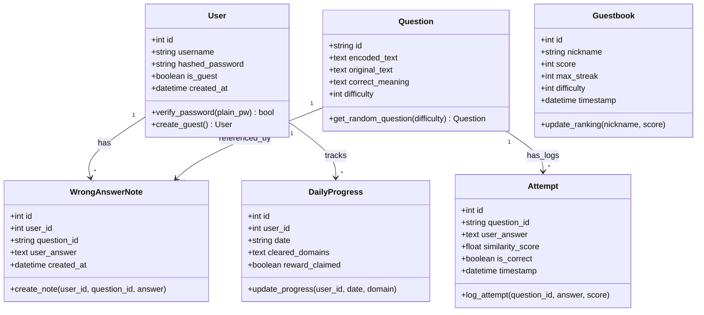
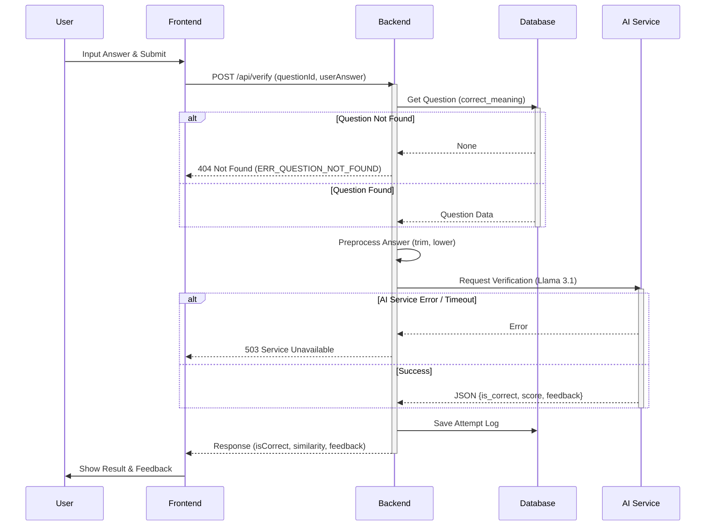

# LLD (Low-Level Design) - Context Hunter

## 1. LLD의 목적
본 문서는 **Context Hunter** 시스템의 구현 상세를 정의하여 개발자가 즉시 코딩할 수 있도록 가이드하는 것을 목적으로 합니다. 클래스 구조, API 명세, DB 스키마, 알고리즘 등을 구체적으로 기술합니다.

## 2. 클래스/모듈 상세 디자인 (Class/Module Design)

### 2.1 Backend Class Diagram (SQLAlchemy Models)

### 2.2 Pydantic Schemas (Data Transfer Objects)

*   **User**: `UserCreate`, `UserLogin`, `UserResponse` (includes `credits`, `owned_themes`)
*   **Question**: `QuestionBase`, `Question`, `QuestionsResponse`
*   **Note**: `WrongAnswerNoteCreate`, `WrongAnswerNoteResponse`
*   **Verification**: `VerifyAnswerRequest`, `VerifyAnswerResponse`
*   **Ranking**: `GuestbookCreate`, `RankingEntry`
*   **Daily**: `DailyProgressResponse`, `DailyProgressUpdate`
*   **Shop**: `ShopPurchaseRequest`, `ThemeEquipRequest`

## 3. API 상세 설계 (API Specifications)

### 3.1 Auth API
| Method | Endpoint | Request Body (Validation) | Response Body | 설명 |
| :--- | :--- | :--- | :--- | :--- |
| POST | `/api/auth/register` | `{username(3-20자), password(8자+, 특수문자)}` | `UserResponse` | 회원가입 |
| POST | `/api/auth/login` | `OAuth2PasswordRequestForm` | `{access_token, token_type}` | 로그인 |
| POST | `/api/auth/guest` | - | `{access_token, token_type}` | 게스트 로그인 |
| GET | `/api/users/me` | - | `UserResponse` | 내 정보 조회 |

### 3.2 Game API
| Method | Endpoint | Query Params | Request Body | Response Body | 설명 |
| :--- | :--- | :--- | :--- | :--- | :--- |
| GET | `/api/questions` | `difficulty` (int) | - | `{questions: List[Question]}` | 문제 목록 조회 |
| POST | `/api/verify` | - | `{questionId, userAnswer}` | `VerifyAnswerResponse` | 정답 검증 |

### 3.3 Note API
| Method | Endpoint | Request Body | Response Body | 설명 |
| :--- | :--- | :--- | :--- | :--- |
| POST | `/api/notes` | `{question_id, user_answer}` | `WrongAnswerNoteResponse` | 오답 노트 생성 |
| GET | `/api/notes` | - | `List[WrongAnswerNoteResponse]` | 내 오답 노트 조회 |

### 3.4 Ranking API
| Method | Endpoint | Request Body | Response Body | 설명 |
| :--- | :--- | :--- | :--- | :--- |
| GET | `/api/rankings` | - | `List[RankingEntry]` | 랭킹 조회 |

| POST | `/api/guestbook` | `{nickname(2-10자, 비속어 금지), score}` | - | 랭킹(방명록) 저장 |

### 3.5 Daily & Shop API
| Method | Endpoint | Request Body | Response Body | 설명 |
| :--- | :--- | :--- | :--- | :--- |
| GET | `/api/daily-progress` | `date`(YYYY-MM-DD) | `DailyProgressResponse` | 일일 진행 상황 조회 |
| POST | `/api/daily-progress` | `DailyProgressUpdate` | `DailyProgressResponse` | 진행 상황 업데이트 및 보상 |
| POST | `/api/shop/buy` | `{theme_id}` | `{message, credits, owned_themes}` | 테마 구매 |
| POST | `/api/user/equip` | `{theme_id}` | `{message, equipped_theme}` | 테마 장착 |

### 3.6 Error Codes
| Code | Status | Description |
| :--- | :--- | :--- |
| `ERR_USER_DUPLICATE` | 400 | 이미 존재하는 사용자명입니다. |
| `ERR_AUTH_FAILED` | 401 | 아이디 또는 비밀번호가 일치하지 않습니다. |
| `ERR_QUESTION_NOT_FOUND` | 404 | 요청한 문제를 찾을 수 없습니다. |
| `ERR_AI_SERVICE_TIMEOUT` | 503 | AI 서비스 응답이 지연되고 있습니다. 잠시 후 다시 시도해주세요. |

### 3.5 Sequence Diagram (Answer Verification)
### 3.5 Sequence Diagram (Answer Verification)

## 4. DB 상세 설계 (Database Schema)

### 4.1 Tables
*   **users**: `id` (PK), `username` (Unique), `hashed_password`, `is_guest`, `created_at`, `credits`, `owned_themes`, `equipped_theme`, `total_solved`
*   **questions**: `id` (PK), `encoded_text`, `original_text`, `correct_meaning`, `difficulty`, `correct_count`, `total_attempts`
*   **wrong_answer_notes**: `id` (PK), `user_id` (FK), `question_id` (FK), `user_answer`, `created_at`
*   **attempts**: `id` (PK), `question_id` (FK), `user_answer`, `similarity_score`, `is_correct`, `timestamp`
*   **guestbook**: `id` (PK), `nickname`, `score`, `max_streak`, `difficulty`, `timestamp`
*   **daily_progress**: `id` (PK), `user_id` (FK), `date`, `cleared_domains`, `reward_claimed`

### 4.2 ERD (Entity Relationship Diagram)
> 위 클래스 다이어그램 참조 (1:N 관계 위주)

### 4.3 Indexing Strategy
*   **idx_attempts_user_question**: `attempts(user_id, question_id)` - 사용자의 특정 문제 풀이 이력 조회 최적화
*   **idx_users_username**: `users(username)` - 로그인 및 중복 가입 방지 (Unique Constraint)
*   **idx_guestbook_score**: `guestbook(score DESC, timestamp ASC)` - 랭킹 리스트 조회 성능 향상

## 5. 알고리즘/로직 상세 (Core Logic)

### 5.1 정답 검증 로직 (Verify Answer)
1.  **Input**: `questionId`, `userAnswer`
2.  **Process**:
    *   DB에서 `questionId`로 문제 조회 (`correct_meaning` 획득)
    *   `userAnswer` 전처리 (trim, lowercase)
    *   **AI API 호출**: Llama 3.1에게 두 문장의 의미적 유사성 판별 요청 (Prompt Engineering)
    *   **Response Parsing**: AI가 반환한 JSON (`is_correct`, `score`, `feedback`) 파싱
    *   `Attempt` 테이블에 로그 저장
3.  **Output**: `isCorrect`, `similarity`, `feedback`

### 5.2 랭킹 업데이트 로직
1.  **Input**: `nickname`, `score`, `max_streak`
2.  **Process**:
    *   `nickname`으로 `guestbook` 테이블 조회
    *   **조건**: 기존 기록이 없거나, 새로운 `score`가 기존 `score`보다 높을 경우 업데이트
    *   동점일 경우 `max_streak`가 높은 순으로 우선순위 고려 가능 (현재는 점수 위주)
3.  **Output**: Success/Fail

## 6. 보안 및 설정 (Security & Config)

### 6.1 보안 구현
*   **Password Hashing**: `passlib` 라이브러리의 `bcrypt` 알고리즘 사용
*   **JWT**: `python-jose` 라이브러리 사용, `HS256` 알고리즘, 만료 시간 30분 설정
*   **CORS**: `fastapi.middleware.cors` 사용하여 모든 오리진(`*`) 허용 (개발 단계), 배포 시 특정 도메인으로 제한

### 6.2 환경 변수 (.env)
*   `SECRET_KEY`: JWT 서명용 비밀키
*   `DATABASE_URL`: DB 연결 문자열 (예: `sqlite:///./context_hunter.db`)
*   `OPENAI_API_KEY`: AI API 키 (Llama 3.1 사용 시)
*   `AI_BASE_URL`: AI API Base URL (예: Groq, Ollama 등)
*   `AI_MODEL_NAME`: 사용할 모델명 (Default: llama-3.1-8b-instant)

### 6.3 Logging Policy
*   **Access Log**: API 요청/응답 시간, 상태 코드, 클라이언트 IP (Nginx/Uvicorn 레벨)
*   **Application Log**:
    *   **INFO**: 주요 사용자 액션 (로그인, 게임 시작, 랭킹 등록)
    *   **WARNING**: AI 서비스 지연, 잘못된 입력값 반복
    *   **ERROR**: 500 에러 발생 시 Stack Trace, DB 연결 실패

### 6.4 Environment Configuration
*   **Development**:
    *   DB: SQLite (`context_hunter.db`)
    *   Debug: `True` (상세 에러 메시지 노출)
    *   CORS: `*` (모든 출처 허용)
*   **Production (Docker)**:
    *   **Orchestration**: Docker Compose
    *   **Reverse Proxy**: Nginx (Port 65039 -> 80)
    *   DB: MariaDB (Containerized)
    *   Debug: `False`
    *   CORS: 프론트엔드 도메인만 허용

## 7. 제한사항 및 예외 처리
*   **API Error Handling**: `HTTPException`을 사용하여 명확한 상태 코드(400, 401, 404, 500) 반환
*   **DB Connection**: `SessionLocal`을 사용하여 요청별 세션 생성 및 종료 (`yield` 패턴)
*   **AI API Failure**: 외부 API 호출 실패 시 503 에러 반환 (로컬 Fallback 없음)
