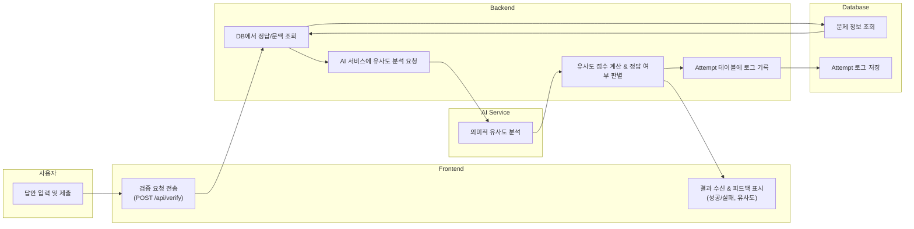

```mermaid
flowchart LR

    %% Subgraph(영역 구분)
    subgraph USER["사용자"]
        U_Input["답안 입력 및 제출"]
    end

    subgraph FRONTEND["Frontend"]
        FE_Request["검증 요청 전송<br>(POST /api/verify)"]
        FE_Response["결과 수신 & 피드백 표시<br>(성공/실패, 유사도)"]
    end

    subgraph BACKEND["Backend"]
        BE_Query["DB에서 정답/문맥 조회"]
        BE_AI["AI 서비스에 유사도 분석 요청"]
        BE_Judge["유사도 점수 계산 & 정답 여부 판별"]
        BE_Log["Attempt 테이블에 로그 기록"]
    end

    subgraph DB["Database"]
        DB_Question["문제 정보 조회"]
        DB_Attempt["Attempt 로그 저장"]
    end

    subgraph AI["AI Service"]
        AI_Sim["의미적 유사도 분석"]
    end

    %% 흐름
    U_Input --> FE_Request
    FE_Request --> BE_Query
    BE_Query --> DB_Question
    DB_Question --> BE_Query

    BE_Query --> BE_AI
    BE_AI --> AI_Sim
    AI_Sim --> BE_Judge

    BE_Judge --> BE_Log
    BE_Log --> DB_Attempt

    BE_Judge --> FE_Response
```
